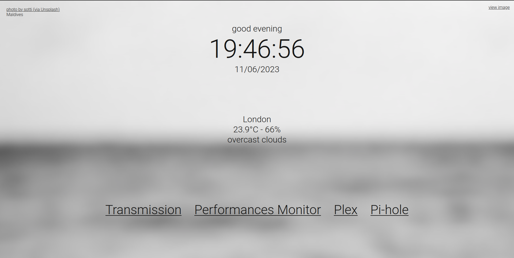
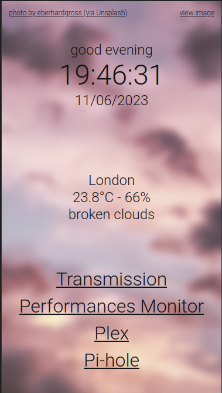

# RPi Homepage

A *(formerly Flask-based)* Fastapi-based dashboard for my RaspberryPi

## Background

Since I bought a Raspberry Pi 4, I started installing a lot *(and I mean a lot)* of services, to the point I had to move some of them to another embedded device *(an Odroid, this time)*.
As of now, shared between the two devices, the following services are running:

- Plex
- PiHole
- Transmission
- Jellyfin
- MiniDLNA
- Node Red
- Home Assistant
- probably some more that I can't even remember right now.

Given the premises, you can imagine how I could never remember the URL path and the port of each service, let alone their IP address.

So this is how the RPi homepage was born. It's a simple, quick, easy way to connect to some important service and why not, get local time and weather in a clean-looking, minimal, interface?
The webpage is completely scalable as I have tested it on many devices and screen resolutions.

## Code structure

This whole backend is coded in Python using the Fastapi framework.
I moved from Flask to Fastapi because the GitHub dependency bot was complaining about some security issues in the Flask codebase, I could not find a way to structure the code in an OOP style.

The backend script is supported by a `Server` class that I copied from another project of mine *(I swear, I'll make it public one day)*.
It wraps the Fastapi app making it easier to add routes and endpoints.

The front end is written in vanilla JS.
Previously, I wrote it all in jQuery but let's be honest, in nova days it's useless as Javascript has evolved enough to include css selectors for DOM elements (can you imagine!), callbacks (unbelievable!), and HTTP requests (no more Ajax!).
Furthermore, CSS itself now supports transitions and animations, thus making jQuery even more useless.

### Homepage

My goal was to make a simple, clean, minimal page that could display the most important information at a glance.
To accomplish this, I divided the page into 3 sections:

1. the top section, displaying the time and a greeting message
2. the middle section, displaying the weather forecast for the day
3. the bottom section, displaying the links to the services

In the background, a random image is displayed.
The images are fetched from [Unsplash](https://unsplash.com/), a website that provides images via a free API (for personal use).
To prevent too many fetches, a link is cached for a length of time, customisable in the settings file.

The catch is finding the correct image category to display: colourful and high-contrast images are not good for text readability.
After a while, I have settled on the following categories:

- "abstract"
- "graffiti"
- "scenery"
- "set"
- "wallpaper"

These seem to be the best categories to display a nice image that doesn't interfere with the text on top of it.
To guarantee even better readability, the image is blurred and desaturated, with higher effect around the text.

The weather forecast is provided by [OpenWeather](https://openweathermap.org/), a free weather API.

### Deployment

Thanks to the Fastapi framework, the code can be deployed in many ways.
I am currently using the built-in Uvicorn server: while a more reliant and more robust web server such as Nginx could be used, I don't think it's necessary for this project.
Uvicorn is good enough to handle all the extremely few requests that this project will receive.

## Translations

The code supports multi-language for weather forecasts.

The base code is in Italian. To set the interface into a foreign *(well, for me at least)* language, you have to change the parameter inside the *settings.json* file.

## Installation

To use this script, you have to:

1. Clone or download this repo on your computer
1. Navigate to `settings/` folder
1. Rename `settings.example.toml` to `settings.toml` and complete it with all the necessary information
   - api keys for OpenWeather and Unsplash are needed
1. Rename `links.example.toml` to `links.toml` and edit it until it fits all your needs
1. Rename the file `greetings.example.toml` to `greetings.toml` and edit it until it fits all your needs
1. Go back to the main folder
1. Create a virtual environment with `python3 -m venv venv`
1. Activate the virtual environment with `source venv/bin/activate`
1. Install the required packages with `pip install -r requirements.txt`
1. Run the script with `python3 rpi-homepage.py`
1. Open your browser and navigate to `http://localhost:1234` *(or whatever port you set in the settings file)*
1. Done!

## Screenshots

## License

This project is distributed under the MIT license. See [LICENSE.md](LICENSE.md) for more information.
