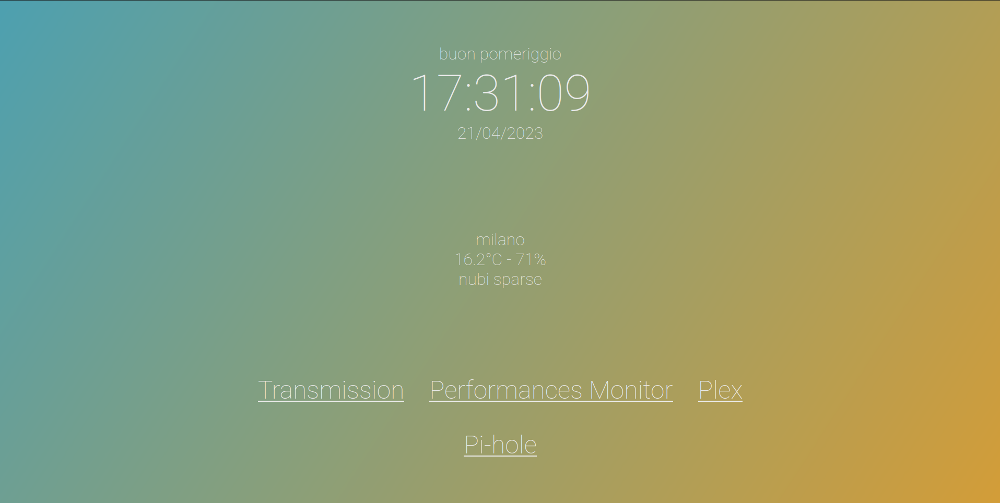
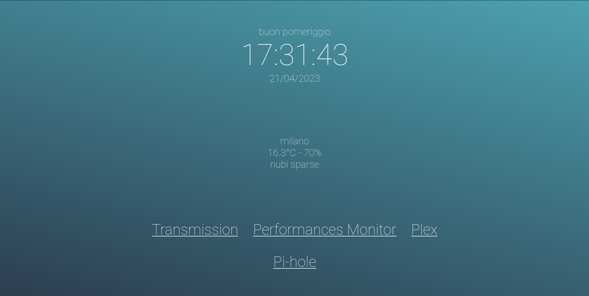

# rpi-homepage

A *(formerly Flask-based)* Fastapi-based dashboard for my RaspberryPi

## Background

Since I bought a RaspberryPi 4, I started installing a lot *(and I mean a lot)* of services, to the point I had to move some of them to another embedded device *(an Odroid, this time)*.
As now, shared between the two devices, the following services are running:

- Plex
- PiHole
- Transmission
- Jellyfin
- MiniDLNA
- Node Red
- Home Assistant
- probably some more that I can't even remember right now.

Given the premises, you can imagine how I could never remember the url path and the port of each service, let alone their IP address.

So this is how *rpi-homepage* was born. It's a simple, quick, easy way to connect to some important service and why not, get local time and weather in a clean-looking, minimal, interface.
The webpage is completely scalable as I have tested it on many devices and screen resolutions.

## Code structure

This whole backend is coded in Python using Fastapi framework.
I moved from Flask to Fastapi because the GitHub dependency bot was complaining about some security issues in the Flask codebase, I could not find a way to structure the code in a OOP style.

The backend script is supported by a `Server` class that I copied from another project of mine (I swear, I'll make it public one day).
It wraps the Fastapi app making it easier to add routes and endpoints.

The front end is written in vanilla JS.
Previously, I wrote it all in jQuery but let's be honest, nova days it's useless as Javascript has evolved enough to include css selectors for DOM elements (can you imagine!), callbacks (unbelievable!), and HTTP request (no more Ajax!).
Furthermore, CSS itself now supports transitions and animations, thus making jQuery even more useless.

The weather is fetched from [OpenWeatherMap.com](https://openweathermap.org/) since it's free, fairly correct and reliable enough to fill an (otherwise empty) page.

### Homepage

*TODO*

### Deployment

*TODO*

## Translations

The code supports multi-language for weather forecasts.

The base code is in Italian. To set the interface into a foreign (well, for me at least) language, you have to change the parameter inside *settings.json* file.

## Installation

In order to use this script, you have to:

1. Clone or download this repo on your computer
1. Navigate to `settings/` folder
1. Rename `settings.example.toml` to `settings.toml` and complete it with all the necessary information
1. Rename `links.example.toml` to `links.toml` and edit it until it fits all your needs
1. (optional) customize the `gradients.toml` and `colors.toml` files to your liking
1. Go back to the main folder
1. Create a virtual environment with `python3 -m venv venv`
1. Activate the virtual environment with `source venv/bin/activate`
1. Install the required packages with `pip install -r requirements.txt`
1. Run the script with `python3 rpi-homepage.py`
1. Open your browser and navigate to `http://localhost:5000` (or whatever port you set in the settings file)
1. Done!

## Screenshots

## License

This project is distributed under the MIT license. See [LICENSE.md](LICENSE.md) for more information.
